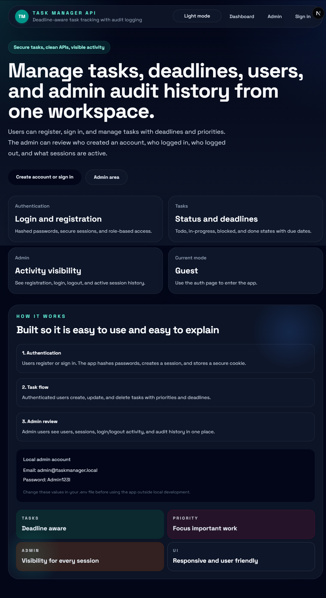
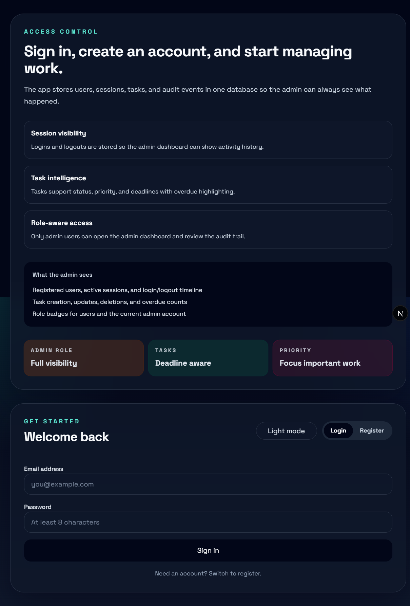

# Task Manager API

A polished full-stack task manager built with Next.js, React, TypeScript, Prisma, SQLite, and secure cookie-based authentication. Users can register, sign in, manage tasks with deadlines and priorities, and the admin can review activity such as signups, logins, logouts, active sessions, and task changes.

## Highlights

- User registration and login with hashed passwords
- Secure session cookies with login/logout tracking
- Task CRUD with status, priority, and deadline support
- Overdue and due-today highlighting
- Admin dashboard with users, sessions, and audit history
- Light and dark mode support
- Clean, responsive UI with a study-friendly codebase

## Tech Stack

- Next.js 16 App Router
- React 19
- TypeScript
- Prisma 7
- SQLite
- Tailwind CSS 4
- bcryptjs for password hashing
- zod for validation
- next-themes for theme switching

## Project Structure

```text
task-manager-app/
	src/
		app/            # Pages and API routes
		components/     # Reusable React components
		lib/            # Server helpers, services, types, and utilities
	prisma/           # Schema, seed file, and local SQLite database
	docs/             # Study guides and reference docs
```

## What You Can Do

- Create an account and log in
- Create, edit, and delete tasks
- Set task status, priority, and deadline
- See overdue tasks and due-today tasks
- Log out safely and track sessions
- Open an admin page to review users and audit events

## Quick Start

### Prerequisites

- Node.js 18 or newer
- npm

### Setup

```bash
npm install
npm run db:generate
npm run db:migrate
npm run db:seed
npm run dev
```

Then open the app at [http://localhost:3000](http://localhost:3000).

If you are starting from a fresh clone, the first migration creates the local SQLite database file and the seed command adds the default admin account.

## Environment Variables

The local development setup uses these values in `.env`:

| Variable | Purpose |
| --- | --- |
| `DATABASE_URL` | Points Prisma to the SQLite database file |
| `ADMIN_EMAIL` | Default admin email for local seed data |
| `ADMIN_PASSWORD` | Default admin password for local seed data |
| `ADMIN_NAME` | Default admin display name |
| `SESSION_DAYS` | Session lifetime in days |

Example local admin:

- Email: `admin@taskmanager.local`
- Password: `Admin123!`

## Available Scripts

| Script | What it does |
| --- | --- |
| `npm run dev` | Starts the development server |
| `npm run build` | Builds the app for production |
| `npm run start` | Runs the production build |
| `npm run lint` | Runs ESLint |
| `npm run db:generate` | Generates the Prisma client |
| `npm run db:migrate` | Applies Prisma migrations |
| `npm run db:seed` | Seeds the default admin account |
| `npm run db:studio` | Opens Prisma Studio |

## API Overview

| Route | Method | Purpose |
| --- | --- | --- |
| `/api/auth/register` | POST | Creates a new account |
| `/api/auth/login` | POST | Signs a user in |
| `/api/auth/logout` | POST | Signs a user out |
| `/api/auth/me` | GET | Returns the current session |
| `/api/tasks` | GET | Loads the dashboard snapshot |
| `/api/tasks` | POST | Creates a new task |
| `/api/tasks/[taskId]` | PATCH | Updates a task |
| `/api/tasks/[taskId]` | DELETE | Deletes a task |
| `/api/admin/overview` | GET | Returns admin analytics |

## How The App Works

### Authentication Flow

1. The user submits the login or registration form.
2. The React component sends the request to an API route.
3. The route validates the input with Zod.
4. The service hashes passwords, creates sessions, and stores audit logs.
5. The browser receives an HTTP-only cookie.

### Task Flow

1. The dashboard loads the current task snapshot.
2. The user creates or updates a task from the form.
3. The API route validates the task data.
4. The service writes the task to SQLite through Prisma.
5. The dashboard refreshes with the latest data.

### Admin Flow

1. The admin opens the admin page.
2. The page checks the user role before showing the data.
3. The admin overview service loads users, sessions, and audit events.
4. The admin UI lets the reviewer search and filter activity.

## Security Notes

- Passwords are hashed with bcrypt before being stored.
- Session tokens are hashed in the database.
- Session cookies are HTTP-only.
- Role checks protect the admin dashboard.
- Input is validated before database writes happen.

## Learning Resources

- [docs/project-guide.md](docs/project-guide.md) for the full project explanation
- [docs/reference-guide.md](docs/reference-guide.md) for the study reference
- [docs/react-typescript-walkthrough.md](docs/react-typescript-walkthrough.md) for the file-by-file React and TypeScript walkthrough

## Screenshots

### Home page



### Auth page



## Default Admin Account

For local development, the project creates this admin account:

- Email: `admin@taskmanager.local`
- Password: `Admin123!`

Change these values before using the project outside your own machine.

## Notes For GitHub

- This repo is ready for a GitHub upload with a detailed README and a project-specific `.gitignore`.
- The README now includes a screenshots section and the repo includes an MIT license file.

## License

This project is released under the MIT License. See [LICENSE](LICENSE) for the full text.
